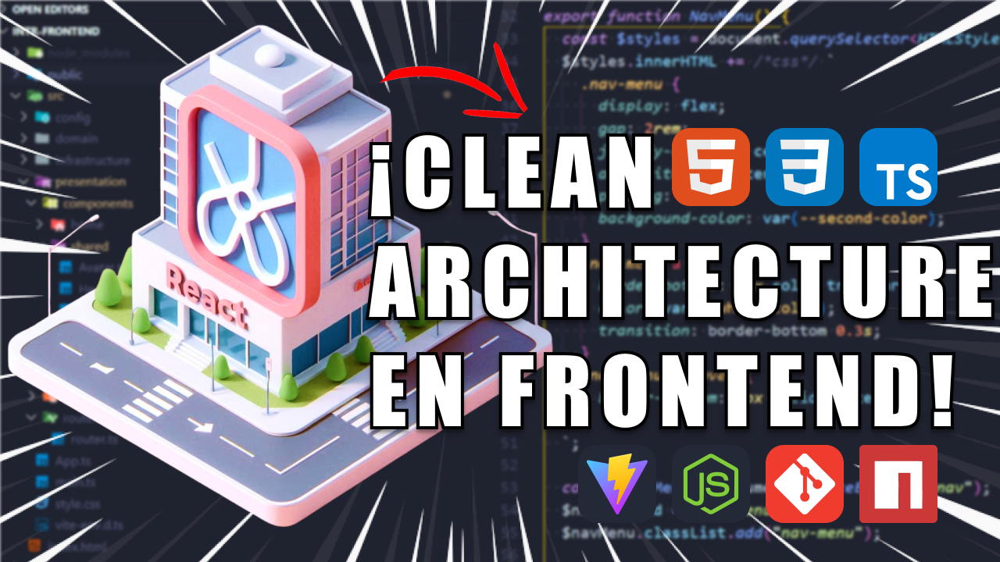
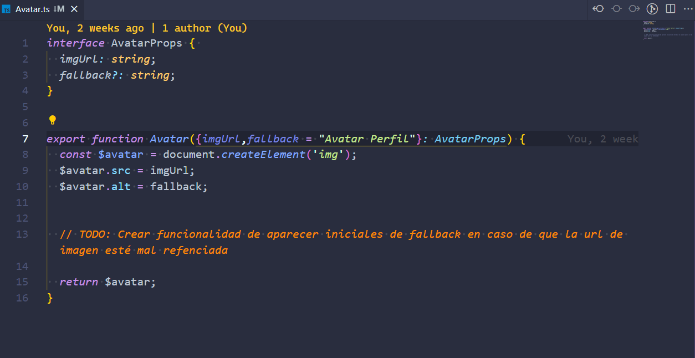
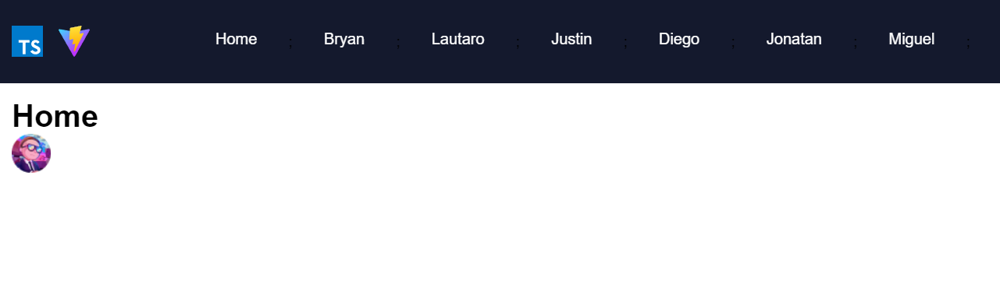
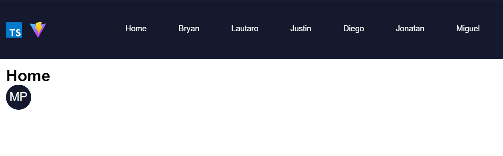
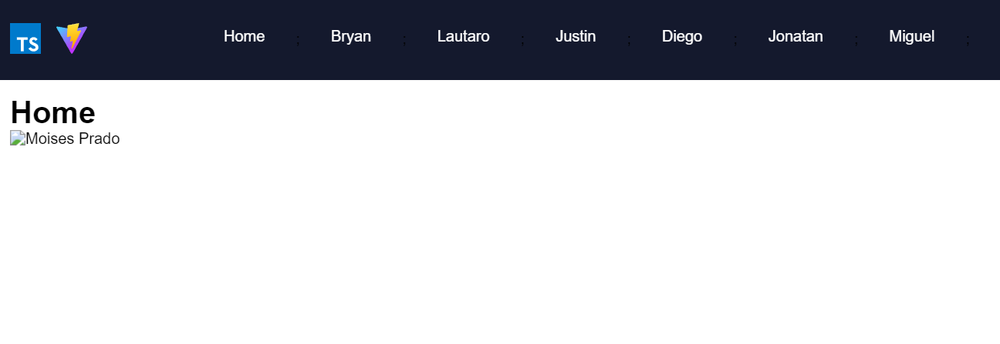
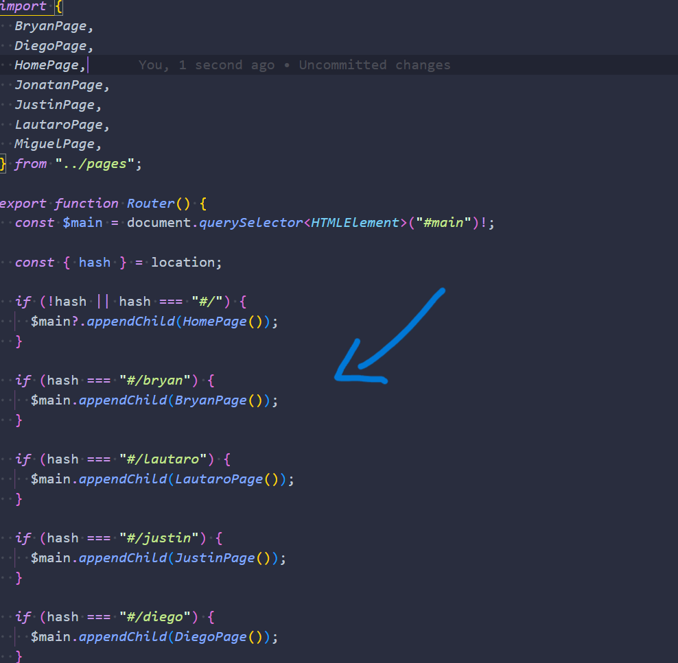
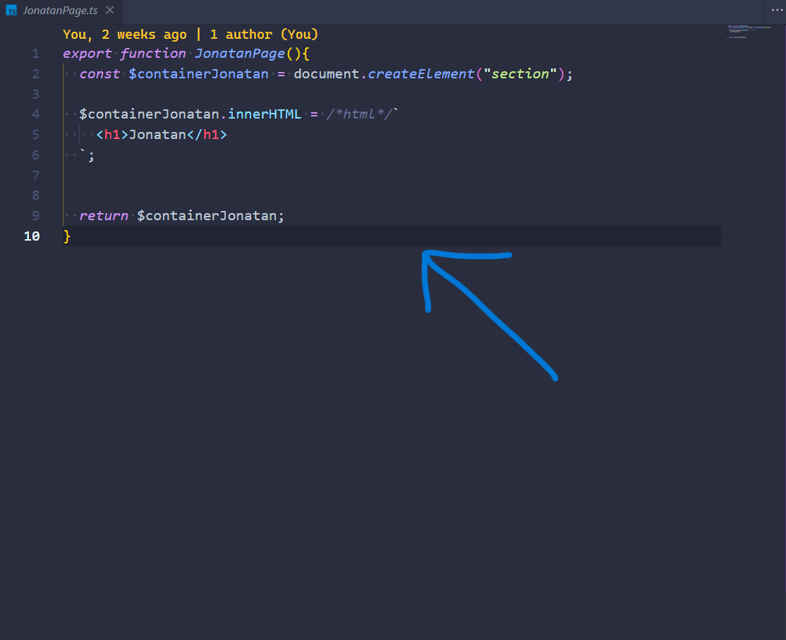
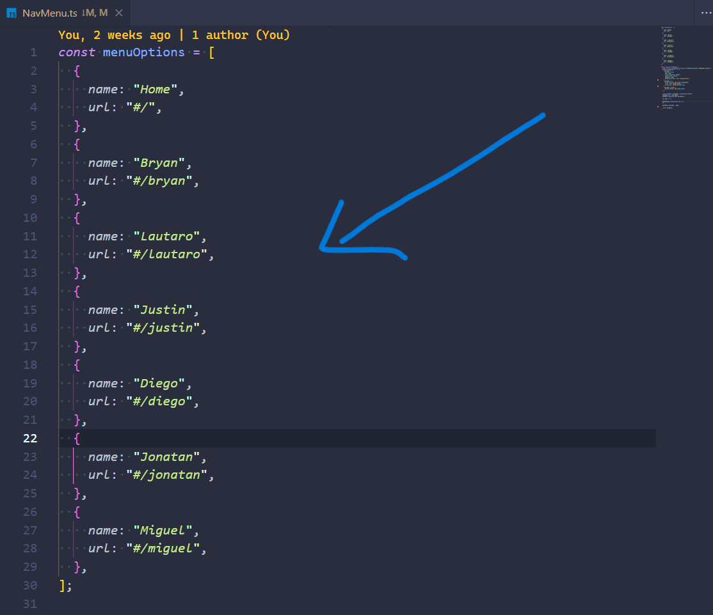

<h1 style="text-align: center;">
  Intro al frontend para react creando una SPA con <em>HTML, CSS, JS, TS y NodeJS</em> basado en Clean Architecture.
   
  💻📂📖🗒️💻
</h1>

A continuación se especificarán tareas o desafios a realizar despues de la clase o reforzamiento realizado. 

Además se agregan blogs útiles que complementan la clase (ver estos en [Blogs y docs frontend](./README-BLOGS.md)).

Por último mencionar que estás tareas se plantean en reuniones grabadas de discord que posteriomente se suben a youtube.

## Tareas de SPA con Typescript y Frontend basado en Clean Architecture:
A continuación se especificarán todas las tareas a realizar que se harán en esta introducción de
_Frontend_ para _React_. 

Y que además, se detallarán más en el siguiente canal de youtube: [addev](https://www.youtube.com/@addevmoises)

___

### **Tarea 1:** crear fallback a componente Avatar existente.
- Ver más detalles de tarea en el siguiente video en el minuto **_1:30:53_**: [Base para Aprender React con Clean Architecture: Frontend con HTML, CSS y TypeScript: (Parte 1)](https://youtu.be/TNFrjhVi7uo?si=kfVjQPrR8kZqTwlD) (Desde ese minuto se crea el componente avatar y se explica la tarea, además en la descripción podrás ver un índice temático para más exactitud).

- Debes agregar funcionalidad adicional de fallback al componente avatar de la carpeta `/presentation/components/shared`. A continuación los detalles: 

1. #### La tarea es que en el componente `Avatar.ts` agregues la funcionalidad para que se agreguen las iniciales de las palabras especificadas en la propiedad *_"fallback"_* si se referencia mal la URL de la propiedad *_"urlImg"_* para agregar una imagen.
    - ##### Código actual que se debe extender con más código pero no modificar el existente:
    

    - ##### Como se ve actualmente el avatar si se pasa las props `imgUrl` con una url de imagen bien referenciada y el `fallback`:
    

    - ##### Como debe verse el avatar si se pasa las props `imgUrl` con una url de imagen mal referenciada y un `fallback` al realizar la tarea (tomaremos como ejemplo el fallback _"Moises Prado"_ para que las iniciales que se muestren sean _"MP"_):
    

    - ##### Como se ve actualmente el avatar si se pasa las props `imgUrl` con una url de imagen mal referenciada y el `fallback` sin las funcionalidad de las iniciales:
    

___

2. #### La idea es que al agregar la nueva funcionalidad del avatar no se pierda la funcionalidad anterior de mostrar la imagen de este.

___

3. #### Cada participante del desafio tiene una página (o tiene que crearla en `/presentation/pages` y registrarla en el `/router/router.ts`) para poder llamar a su componente `Avatar.ts` y tener su propio espacio de trabajo (tambien para otras tareas futuras).
    - ##### Para registrar las páginas tienes que agregar un `if` y agregar la página agregada como se ve a continuación en el `router.ts` con tu propio nombre (que no exista ya registrado):
    

    - ##### Ejemplo de como crear tu propia página (El archivo debe tener la siguinte nomenclatura `NombrePage.tsx` al igual que el nombre del componente de página).
    

    - ##### Por último debes agregar al componente `NavMenu.ts` en el arreglo de objetos `menuOptions.ts` tu nombre y ruta de página que registraste en el `router.ts` como se ve a continuación:
    

___    

4. #### Pueden llamar a cualquier url de imagen que agreguen a `/public` o que esté en internet.

